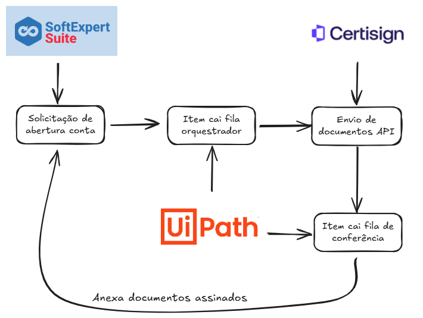

# 🦾 UiPath REFramework em C#

Este projeto é uma adaptação do REFramework (Robotic Enterprise Framework) do UiPath, recriado em **C#** e **VB.Net** como forma de estudo e documentação. Ele simula o fluxo de um robô RPA estruturado, com boas práticas de controle de exceções, logs, separação de responsabilidades e modularidade.

---

## 🔧 Principais Automações

Este projeto foi desenvolvido para automatizar um fluxo completo de validação e gerenciamento de assinaturas de documentos. Abaixo estão os principais pontos de automação implementados:

### 📑 Validação e Gerenciamento de Assinaturas

- ✅ Verificação automática das assinaturas pendentes e concluídas em documentos.
- 🔗 Geração e envio de links de assinatura personalizados para cada destinatário.
- 📬 Envio de e-mails para os responsáveis por assinar os documentos.

### 📁 Manipulação de Arquivos

- 📦 Download e extração automática de arquivos ZIP contendo documentos PDF.
- 🔍 Leitura e análise dos arquivos PDF para conferência de assinaturas.
- 📤 Upload dos documentos assinados para sistemas externos (via API).

### 📧 Comunicação Automática

- 🚨 Envio de e-mails de alerta para assinantes pendentes.
- 📨 Envio de documentos finalizados via e-mail ou API (ex: Portal de Assinaturas, SeSuite).
- ⏰ Agendamento automático de reenvios ou alertas baseados em tentativas e prazos.

### 🔄 Controle e Reprocessamento

- ♻️ Reprocessamento automático de transações falhas com tentativas controladas.
- 🗂️ Registro e status de cada transação (sucesso ou falha) com logs centralizados.

### 🌐 Integrações Externas - API

- 🔌 Comunicação com o **Portal de Assinaturas** para verificação e envio de status.
- 🔗 Integração com o **SeSuite** para acompanhamento e upload de documentos assinados.


## 📸 Fluxo do Robô



> A imagem acima representa o ciclo de vida do robô, inspirado no REFramework tradicional.

---

## 📌 Estrutura Geral

O projeto segue a estrutura básica:

```text

├── GetTransactionData.cs
├── InitAllApplications.cs
├── InitAllSettings.cs
├── send_emails.cs
├── ProcessTransaction.cs
├── Send_manifest.cs
├── signers_manipulation.cs


```
---

## 🧠 Lógica de Execução

1. **InitAllSettings.cs**  
   Lê configurações de um arquivo `config.txt`. Esse arquivo tem todo o direcionamento para o orquestrador do Uipath

2. **InitAllApplications.cs**  
   Simula a inicialização de aplicativos necessários para o processo.

3. **GetTransactionData.cs**  
   Busca itens de uma lista simulando uma fila de transações. Todos os itens estão em uma fila do orquestrador

4. **ProcessTransaction.cs**  
   Processa uma transação individual.

5. **send_emails.cs**  
   Envio de emails para os assinantes com os links de assinatura ao fim da transação processada.

6. **signers_manipulation.cs**  
   Formatação de um Json em VB.net, usado com invokecode no Uipath para tratar os dados da fila e enviar o json para api do portal de assinatura.

7. **Send_manifest.cs**  
   Processa uma transação de conferência dos documentos assinados, envia alerta para assinates ou anexa os documentos já assinados na solicitação inicial.

---


